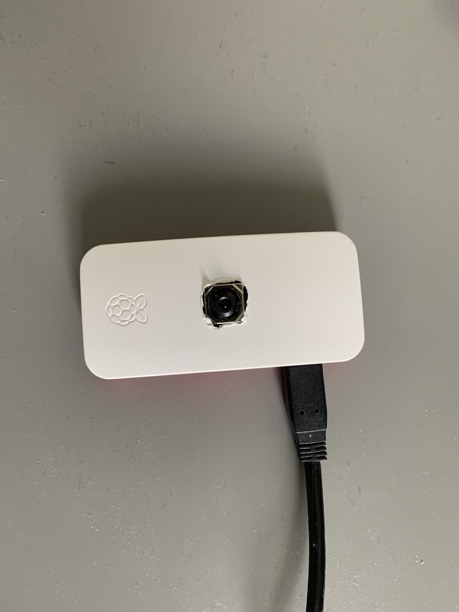
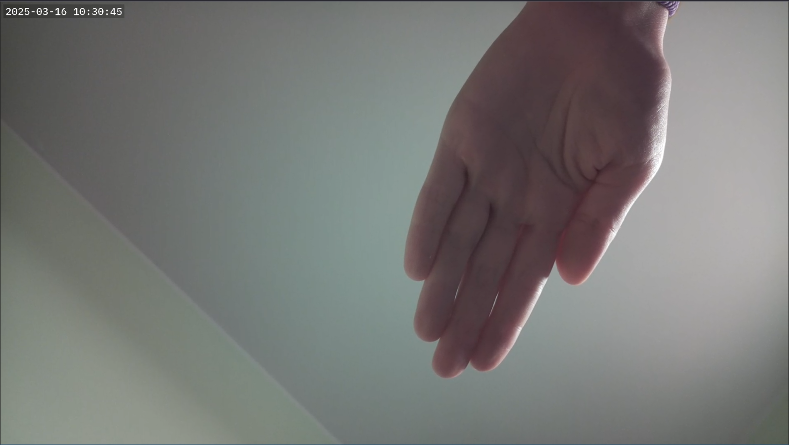

# BabyPI
This project creates a nanny cam using a Raspberry Pi Zero 2 W with Camera Module v3. It generates a custom Linux image using Yocto, including all necessary packages for low-latency video streaming. The stream is accessible via a web browser on your phone or PC.

Hardware photo, I had to cut the hole for the camera myself:


Video stream:


## Prerequisites
Before building, ensure you have:
- A **Raspberry Pi Zero 2 W** with **Camera Module v3**
- A microSD card (at least **4GB recommended**)
- **Docker** installed on your system
- `just` command runner installed (`cargo install just`)

## Build Instructions
This project uses a `justfile` for automated setup and build. Follow these steps:

### **1. Setup the Build Environment**
Run:
```sh
just setup
```
This prepares the bblayers.conf and local.conf files.
Modify local.conf to configure WiFi settings:
```
WIFI_SSID="YOUR_SSID"
WIFI_PSK="YOUR_PASSWORD"
WPA_COUNTRY="YOUR_COUNTRY"
```
### **2. Build the docker image**
Run:
```sh
just docker-build
```
This will create a Docker container to handle the build process.

### **3. Build the Yocto Image**
Run:
```sh
just build-from-docker
```
Note: This process takes time and requires significant disk space. Be patient.

### **4. Flash the Image to SD Card**
Once the build completes, flash the image to your SD card:
```sh
just flash <device>
```

For example:
```sh
just flash /dev/sdb
```
Tip: You can check the device name using:
```sh
lsblk
```
Or
```sh
sudo dmesg
```
The flashing process should be quick (<500MB image).

### **5. Start the Raspberry Pi**
* Insert the SD card into the Raspberry Pi.
* Power it on and wait for it to connect to WiFi.

### **6. Access the Video Stream**
System uses avahi-daemon to easily find a device using mDNS. To access the video stream you simply need to go to website http://babypi.local:8889/cam
